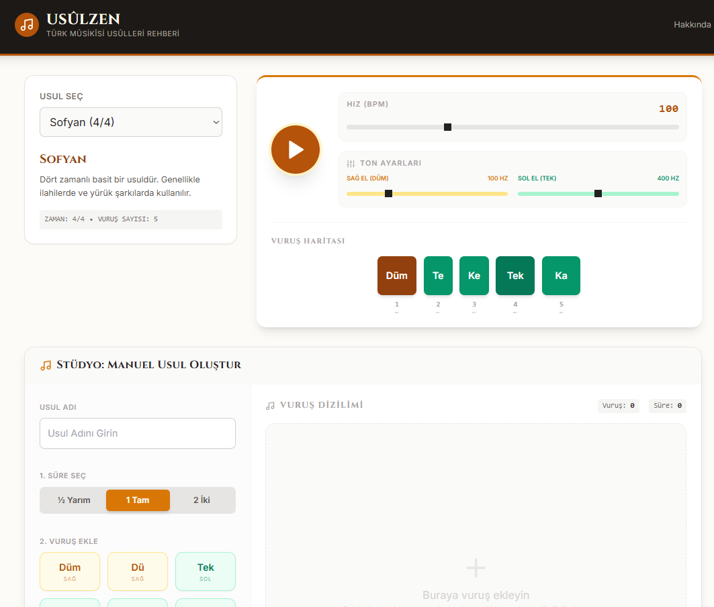

# Usulzen - Türk Musikisi Ritim Rehberi

Usulzen, Türk Sanat Musikisi usullerini (ritimlerini) görsel ve işitsel olarak keşfetmek, analiz etmek ve öğrenmek için tasarlanmış interaktif bir web uygulamasıdır.



## Özellikler

- **Klasik Usul Kütüphanesi:** Sofyan, Düyek, Aksak, Devr-i Revan gibi temel usulleri dinleyin ve izleyin.
- **Görsel Ritim Haritası:** Vuruşların zaman çizelgesi üzerinde renkli ve anlaşılır gösterimi.
- **Ton Ayarları:** Düm (Sağ el) ve Tek (Sol el) seslerinin frekanslarını (Hz) anlık olarak ayarlayabilme.
- **Stüdyo Modu (Manuel Besteleme):** Kendi usulünüzü vuruş vuruş oluşturun, kaydedin ve oynatın.
- **Kudüm/Diz Vuruşu Simülasyonu:** Vuruşların hangi elle (sağ/sol) yapıldığını simüle eden görselleştirme (Ayna modu destekli).

## Kurulum ve Çalıştırma

Bu projeyi yerel bilgisayarınızda çalıştırmak için:

1.  **Depoyu Klonlayın:**
    ```bash
    git clone https://github.com/KULLANICI_ADINIZ/usulzen.git
    cd usulzen
    ```

2.  **Bağımlılıkları Yükleyin:**
    ```bash
    npm install
    ```

3.  **Uygulamayı Başlatın:**
    ```bash
    npm run dev
    ```

## Teknolojiler

- **Frontend:** React 19, TypeScript
- **Stil:** Tailwind CSS
- **Ses:** Web Audio API (Gerçek zamanlı osilatör sentezi)
- **İkonlar:** Lucide React

## Lisans

MIT
